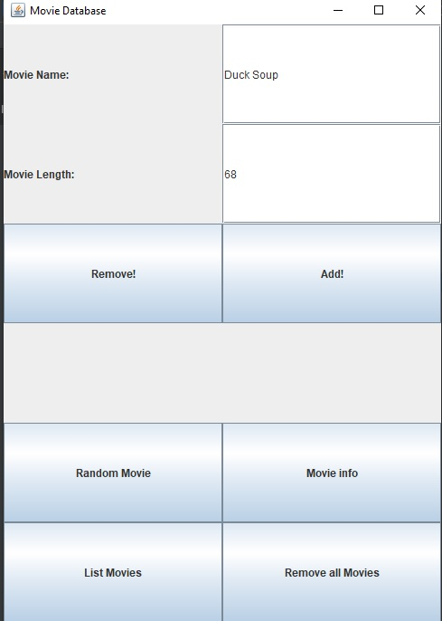

#Readme

Movie Time 

This Java program arranges movies by their length to make it easier to figure out what to watch on any given night.
Users enter a movie with its length which is entered into an auto-sorted database.

There are six possible buttons on the GUI.

1. Add a movie with it's length
2. Remove a movie
3. Remove all movies
4. Open a search for the movie on letterboxd.com
5. Display a random movie
6. Display all movies entered

In the future, the program will be hooked up to a database for storage. 

All tests complete and the program runs fine on any desktop. Just clone the depository and fire it up on any Java IDE.

User Interface:

